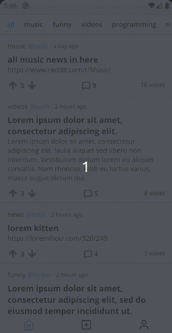
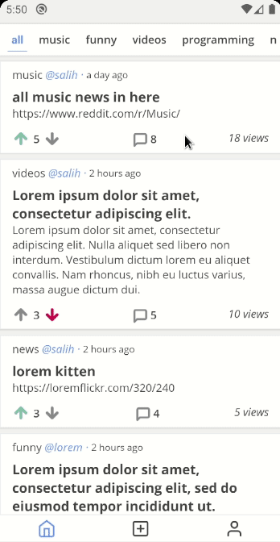

## :rocket: Technologies

- NodeJs
- Express
- MongoDB
- Mongoose
- React Native
- React Navigation
- Reactotron

## :eyes: Preview

<div style="display: inline">



</div>

## :warning: Prerequisite

[React Native Environment](https://reactnative.dev/docs/environment-setup)

## :cd: How to run local

```bash
# Clone this repository
$ git clone https://github.com/salihozdemir/reddit-clone.git

# Go into the repository
$ cd reddit-clone

# Go into server
$ cd server

# Start mongodb locally
$ mongod

# Install dependencies
$ yarn

# Start the backend server
$ yarn dev

# On another terminal, go to the client folder
$ cd ../client

# Install dependencies
$ yarn

# To connect to the server side, you must replace the IP address in the src/utils/fetcher file.
$ cd src/utils/fetcher => Change IP address

# Use the command below for Android devices
$ yarn android
```

## :mag_right: Testing

Make sure mongodb is running before testing the server.

```bash
$ cd server
$ yarn test
```

## :memo: License

This project is made available under the MIT License.
